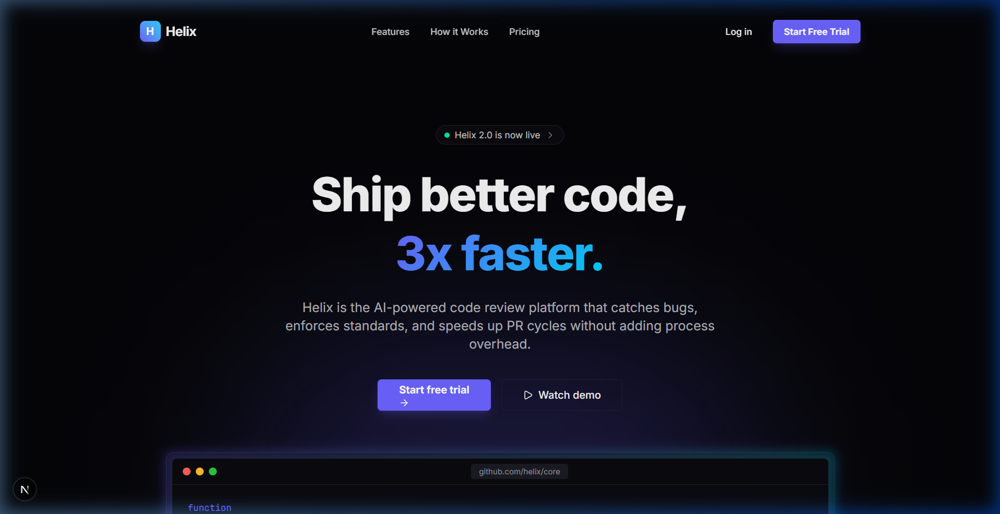
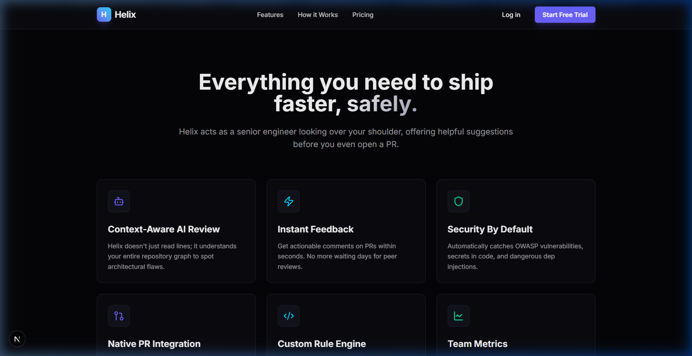
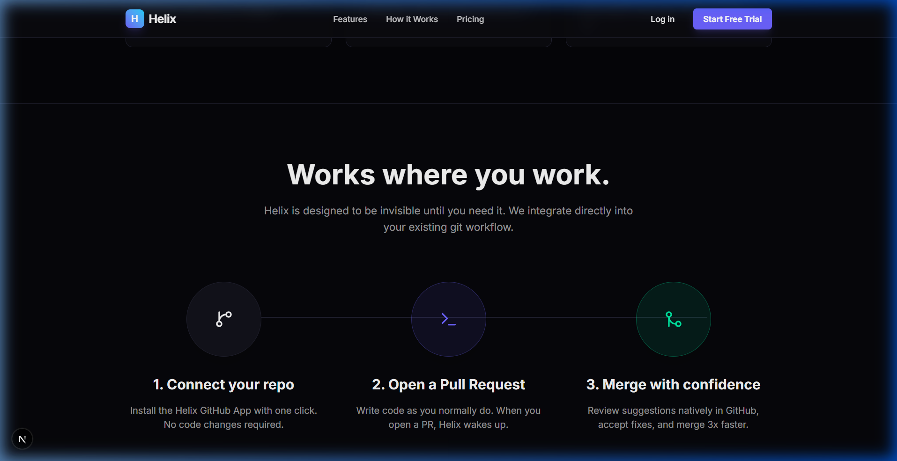
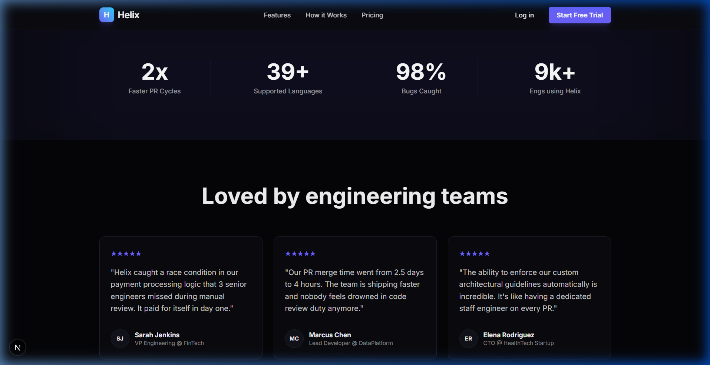
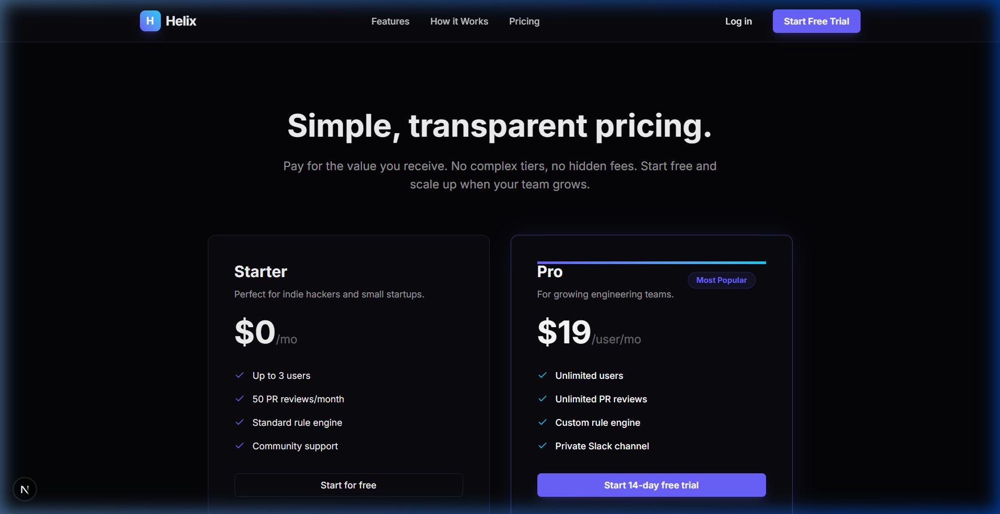
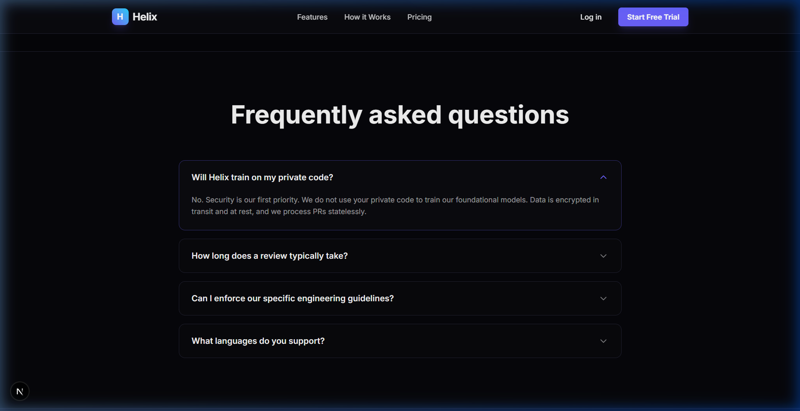

# Helix — AI-Powered Code Review Platform

> **Take-Home Assignment** — Factual Holding Co.  
> High-converting landing page built with Next.js, TypeScript & Tailwind CSS.

**Live Demo:** [helix-landing.vercel.app](https://helix-landing.vercel.app) _(deploy link goes here)_

---

## 📸 Screenshots

### Hero


### Features


### Stats & How It Works


### Testimonials


### Pricing


### FAQ


---

## 🚀 Product

**Helix** is a fictional AI-powered code review platform for engineering teams. It catches bugs, enforces best practices, and speeds up PR cycles — without adding process overhead.

**Tagline:** *Ship better code, 3x faster.*

---

## 📐 Conversion Design Decisions

| Section | Conversion Goal |
|---|---|
| **Navbar** | Sticky CTA always in view as user scrolls |
| **Hero** | Value prop readable in <5s, two CTAs (primary + demo) |
| **Social Proof Bar** | Scrolling logo marquee — builds trust at second glance |
| **Features** | 6-card grid with icons, hover glow — scannable benefits |
| **How It Works** | 3-step flow removes friction, answers "but how?" |
| **Stats** | Animated counters (3x, 40+, 99%, 10k+) — validates claims |
| **Testimonials** | 3 role-specific quotes from VPs and CTOs |
| **Pricing** | Two clear plans; Pro highlighted; "Most Popular" badge |
| **FAQ** | Accordion handles top 4 objections: privacy, speed, customization, language support |
| **Final CTA** | Repeat offer with gradient glow block + trust copy below button |

---

## 🛠️ Tech Stack

- **Framework:** Next.js 14 (App Router)
- **Language:** TypeScript
- **Styling:** Tailwind CSS v4
- **Animation:** Framer Motion
- **Icons:** Lucide React
- **Fonts:** Inter + JetBrains Mono (via `next/font`)
- **Deployment:** Vercel

---

## 🎨 Design System

| Token | Value |
|---|---|
| Background | `#050508` |
| Surface | `#0A0A0F` |
| Brand (Violet) | `#6C63FF` |
| Accent (Cyan) | `#00D4FF` |
| Success (Mint) | `#00E5A0` |
| Foreground | `#F4F4F5` |

**Typography:** Inter for UI text, JetBrains Mono for code blocks

**Motion patterns:**
- Hero elements animate in with staggered `fadeUp` on mount
- Sections use `whileInView` fade-up with `once: true`
- `AnimatedCounter` uses `requestAnimationFrame` easing on viewport entry
- `GlowCard` shows violet border glow and background gradient on hover
- `Button (shine)` has shimmer sweep animation on hover

---

## 📁 Project Structure

```
src/
├── app/
│   ├── layout.tsx          # Root layout, fonts, SEO metadata
│   ├── page.tsx            # Page composition
│   └── globals.css         # CSS variables, custom utilities
├── components/
│   ├── layout/
│   │   ├── Navbar.tsx      # Sticky nav with scroll detection
│   │   └── Footer.tsx      # 4-column footer
│   ├── sections/
│   │   ├── Hero.tsx        # Hero with animated code mockup
│   │   ├── SocialProof.tsx # Scrolling logo marquee
│   │   ├── Features.tsx    # 6-card feature grid
│   │   ├── HowItWorks.tsx  # 3-step process
│   │   ├── Stats.tsx       # Animated counters
│   │   ├── Testimonials.tsx
│   │   ├── Pricing.tsx     # 2-tier pricing cards
│   │   ├── FAQ.tsx         # Animated accordion
│   │   └── FinalCTA.tsx    # Bottom CTA with gradient
│   └── ui/
│       ├── Button.tsx      # 4 variants incl. shimmer shine
│       ├── GlowCard.tsx    # Hover glow card
│       └── AnimatedCounter.tsx
└── lib/
    └── utils.ts            # cn() utility
```

---

## 🏃 Running Locally

```bash
git clone <repo-url>
cd helix-landing
npm install
npm run dev
```

Open [http://localhost:3000](http://localhost:3000)

---

## 📦 Build

```bash
npm run build
npm run start
```

---

## 📝 Notes

- Zero TypeScript errors (`npx tsc --noEmit` passes clean)
- `suppressHydrationWarning` on `<html>` handles browser extension attribute injection (harmless, common Next.js pattern)
- All animations use `once: true` in `whileInView` for performance — they don't re-trigger on scroll-up
- Mobile-responsive at all breakpoints via Tailwind `sm:` / `md:` / `lg:` utilities
